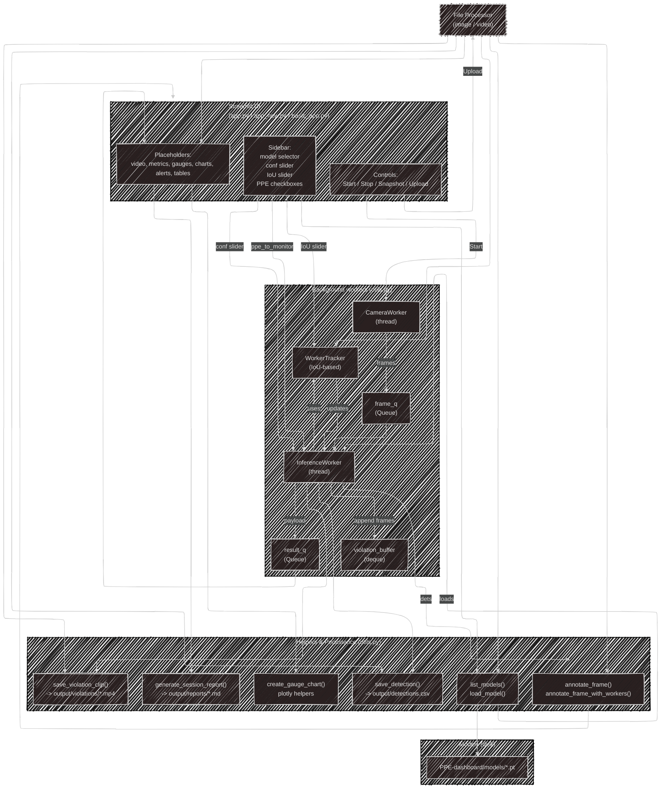

# 🦺 PPE Detection Dashboard

**Real-time PPE Compliance Monitoring with YOLOv8 and Streamlit**

</div>

<p align="center">
  
  
  
  
</p>

A streamlined Streamlit dashboard for **Automated Detection of Personal Protective Equipment (PPE) for Construction Safety** using YOLOv8, focusing on real-time analysis and file processing.



---

## 📖 Table of Contents

* [Project Overview](#-project-overview)
* [Demo](#-demo)
* [🚀 Features](#-features)
* [🛠️ Installation](#-installation)
* [📚 Usage Guide](#-usage-guide)
* [🏗️ Project Structure](#-project-structure)
* [🔮 Future Enhancements](#-future-enhancements)
* [🤝 Contributing](#-contributing)
* [📄 License](#-license)

---

## 📋 Project Overview

This dashboard provides a centralized monitoring solution for PPE compliance on construction sites. It leverages computer vision and deep learning to automatically detect and track:

* 🪖 **Helmets**
* 🦺 **Safety Vests** (Reflective Vests)
* 🧤 **Gloves** (Work Gloves)
* 👢 **Safety Boots**

The application operates in two primary modes: **Live Camera Monitoring** and **File Upload Processing**.

## 🎥 Demo

*(Add a screenshot or GIF of your application in action here!)*

``

---

## 🚀 Features

* **📹 Live Camera Monitoring:** Detects PPE and tracks workers in real-time from a webcam feed.
* **📤 File Processing (Image/Video):** Upload image or video files for "offline" PPE analysis and detection.
* **🏃‍♂️ Real-time Worker Tracking:** Automatically assigns IDs to workers and tracks their compliance status across frames.
* **⚙️ Custom Settings:** Sliders to adjust the **Confidence Threshold** and **IoU Threshold** for detection and tracking.
* **📊 Live Analytics:** A clean UI displaying FPS, total worker count, compliant count, and violation count.
* **📈 Real-time Charts:** Renders a bar chart for PPE compliance rates (per item) and a line chart for violations over time.
* **🔔 Violation Alerts & Logging:**
    * Displays live alerts for workers currently in violation.
    * Logs all compliance state changes to an `output/detections.csv` file for auditing.
* **🎬 Automatic Violation Recording:** Automatically saves a short video clip to the `output/violations/` directory when a new violation is detected.
* **📄 Session Reporting:** Generates a summary report (Markdown) for the entire live monitoring session.

---

## 🛠️ Installation

1.  **Clone the repository:**
    ```bash
    git clone https://github.com/DPL302m-Group03/PPE-Detection.git
    cd PPE-dashboard
    ```

2.  **Install dependencies:**
    *(It is highly recommended to use a virtual environment)*
    ```bash
    pip install -r requirements.txt
    ```
    *(Note: You may need to create a `requirements.txt` file including `streamlit`, `opencv-python-headless`, `pandas`, `plotly`, `ultralytics`)*

3.  **Run the dashboard:**
    ```bash
    streamlit run app.py
    ```

4.  **Open your browser** and navigate to `http://localhost:8501`.

---

## 📚 Usage Guide

1.  **Load a Model:**
    * Place your `.pt` (YOLOv8) model files into the `models/` directory.
    * Select the model from the sidebar and click **"Load Model"**.

2.  **Configure Settings:**
    * Adjust the **Confidence** and **IoU** thresholds as needed.
    * Select the PPE items you wish to monitor (helmet, vest, gloves, boots).

3.  **Choose Mode:**
    * **Live:** Click **"Start Camera"** to begin monitoring from your webcam.
    * **File Upload:** Upload an image or video file in the **"File Upload"** section.

4.  **Monitor:**
    * Observe the video feed, metrics, and violation alerts.
    * Violation clips and the CSV log will be automatically saved to the `output/` directory.

5.  **Finish:**
    * Click **"Stop Camera"** to end the live session.
    * Navigate to the **"Session Summary"** tab and click **"Generate Report"** to get a summary file.

---

## 🏗️ Project Structure

````

ppe-dashboard/
├── app.py              # Main Streamlit UI file
├── utils.py            # Business logic, workers (camera, inference), tracking
├── config.py           # Configuration for paths, colors, and labels
├── style.css           # CSS file for UI styling
├── requirements.txt    # Required Python libraries
├── models/             # Directory for .pt model files
│   └── (e.g., yolov8s\_ppe.pt)
├── output/             # Directory for all outputs
│   ├── detections.csv    # Log of all violations
│   ├── frames/           # Contains snapshots
│   ├── reports/          # Contains session reports
│   └── violations/       # Contains violation video clips
└── README.md           # This documentation file

````

---

## 🔮 Future Enhancements

* [ ] Support for multiple camera streams (e.g., RTSP).
* [ ] Database integration (e.g., SQLite, PostgreSQL) instead of CSV for robust logging.
* [ ] Improved tracking algorithms to handle fast movements and occlusion.
* [ ] Asynchronous file saving to prevent blocking the main thread.

---

## 🤝 Contributing

Contributions are welcome! If you have suggestions for improvements or find any bugs, please feel free to:
1.  Fork the repository.
2.  Create a new branch (`git checkout -b feature/AmazingFeature`).
3.  Commit your changes (`git commit -m 'Add some AmazingFeature'`).
4.  Push to the branch (`git push origin feature/AmazingFeature`).
5.  Open a Pull Request.

---

## 📄 License

This project is distributed under the **MIT License**. See `LICENSE` file for more information (you may need to create this file).

---

<p align="center">
  <strong>⚠️ Safety Note</strong><br>
  This system is designed to <i>assist</i> with safety monitoring and should not replace human supervision and adherence to safety protocols.
</p>